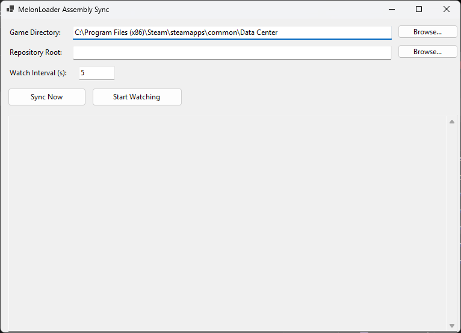

## `refresh_game_refs.py`
**`refresh_game_refs.py`** automatically refreshes the project's game reference data by scanning and updating game identifiers, ensuring internal references stay synchronized with the latest source information. This helps keep game metadata accurate while reducing the need for manual maintenance.

## `AssemblySync`
**`AssemblySync`** is a graphical utility for synchronizing and refreshing game assembly references. It provides a simple, user-friendly interface for updating project reference data without needing to use the command line.

> [!NOTE]
> AssemblySync will automatically create a lib folder for you, when syncing files to the repository folder

